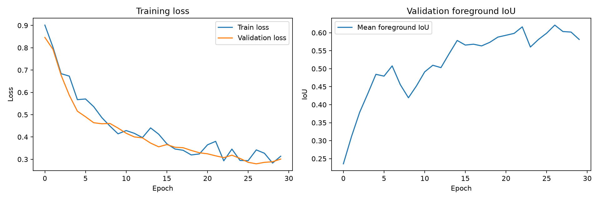
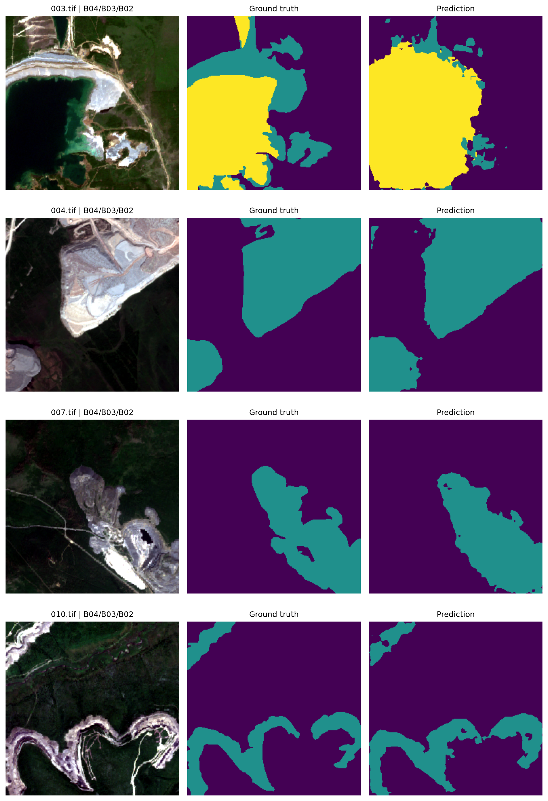

# Semantic Image Segmentation

A solo machine-learning hackathon project for **3-class semantic segmentation of 6-band multispectral GeoTIFF imagery**.

The original solution was developed in **September 2025** using **DeepLabV3+** with an **EfficientNet-B5** encoder. The repository now contains the original notebook together with a cleaned, reproducible training and evaluation pipeline.

## Final result

A reproducible 30-epoch run on the verified recovered subset achieved:

| Metric | IoU |
| --- | ---: |
| Background | **0.8670** |
| Foreground class 1 | **0.7293** |
| Foreground class 2 | **0.5131** |
| **Mean foreground IoU** | **0.6212** |

The main selection metric is **mean foreground IoU**, computed as the mean of the two foreground-class IoUs. Background is reported separately so the majority background class does not dominate the headline metric.

Because only 53 historical image/mask pairs could be verified unambiguously, these numbers should be interpreted as a reproducible reconstruction of the original experiment rather than as a benchmark claim on the full original hackathon dataset.

### Training curves



### Qualitative predictions

The RGB previews below are rendered from the multispectral `B04/B03/B02` bands. Each row shows the input image, ground-truth mask, and model prediction.



## What the project covers

- 6-band multispectral GeoTIFF loading with Rasterio
- bands `B02`, `B03`, `B04`, `B08`, `B11`, `B12`
- recovery of trustworthy image/mask pairs from historical repository data
- per-band normalization estimated from the training split
- Albumentations-based augmentation
- DeepLabV3+ with an ImageNet-pretrained EfficientNet-B5 encoder adapted to 6 input channels
- Dice + class-weighted CrossEntropy loss
- automatic class weighting from training-mask frequencies
- per-class IoU and mean foreground IoU from a full confusion matrix
- checkpoint selection by validation foreground mIoU
- deterministic seeds for PyTorch, DataLoader shuffling, and Albumentations
- prediction visualization and training-curve export
- morphological mask post-processing retained in the original notebook

## Model

| Component | Configuration |
| --- | --- |
| Architecture | DeepLabV3+ |
| Encoder | EfficientNet-B5 (`timm-efficientnet-b5`) |
| Encoder weights | ImageNet pretrained |
| Input channels | 6 (`B02`, `B03`, `B04`, `B08`, `B11`, `B12`) |
| Classes | 3 (`0`, `1`, `2`; background + 2 foreground classes) |
| Input size | 256 × 256 |
| Loss | 0.5 Dice + 0.5 weighted CrossEntropy |
| Optimizer | Adam |
| Initial learning rate | `1e-4` |
| Scheduler | ReduceLROnPlateau |
| Model-selection metric | mean foreground IoU |
| Default seed | `42` |

The original notebook configured four output classes, but inspection of all 152 recovered historical mask files shows that the actual label set is only `{0, 1, 2}`. The cleaned pipeline therefore uses three classes and validates mask labels at load time.

The imagery is not RGB: every verified image contains six multispectral bands. The cleaned pipeline uses all six channels and estimates normalization statistics from the training split instead of applying RGB ImageNet normalization to the raw data.

## Class imbalance

The verified training split contains approximately:

| Class | Pixel share |
| --- | ---: |
| Background | 67.96% |
| Class 1 | 26.32% |
| Class 2 | 5.72% |

To reduce rare-class collapse, CrossEntropy weights are computed automatically using inverse square-root class frequency and normalized to unit mean.

## Data augmentation

Training uses Albumentations with horizontal/vertical flips, random 90° rotations, affine transforms, brightness/contrast perturbation, Gaussian noise and blur, grid distortion, coarse dropout, and per-band normalization. Validation uses deterministic resizing and the same training-derived normalization statistics.

## Repository structure

```text
.
├── artifacts/
│   ├── prediction_examples.png
│   └── training_curves.png
├── main.ipynb          # original hackathon notebook
├── train.py            # reproducible training pipeline
├── evaluate.py         # checkpoint evaluation and per-class IoU
├── inspect_dataset.py  # GeoTIFF pairing diagnostics
├── prepare_dataset.py  # rebuilds the verified paired subset locally
├── requirements.txt
├── .gitignore
└── README.md
```

## Dataset recovery

The dataset itself is intentionally not stored in the current working tree. A historical repository snapshot contains **158 TIFF images** and **152 TIFF masks**, but many filenames do not form trustworthy pairs.

To avoid fabricating correspondences, `prepare_dataset.py` keeps only image/mask pairs with a **unique matching GeoTIFF signature**: dimensions, affine transform, CRS, and bounds. This yields **53 verified pairs**, split with a fixed seed into **42 training pairs** and **11 validation pairs**.

Run:

```bash
python prepare_dataset.py
```

The verified subset is written to `data/paired/`, which is ignored by Git.

## Installation

```bash
git clone https://github.com/Mahan1341/Image-segmentation-hackathon.git
cd Image-segmentation-hackathon
pip install -r requirements.txt
```

For NVIDIA GPU training, install the appropriate CUDA-enabled PyTorch build for the local system instead of relying on a CPU-only wheel.

## Reproduce the experiment

```bash
python prepare_dataset.py
python train.py --epochs 30 --batch-size 4 --seed 42
python evaluate.py
```

On Windows, the script defaults to `num_workers=0` to avoid multiprocessing-related DataLoader failures.

The selected checkpoint is saved as `best_model.pth`. Generated visualizations are written to:

```text
artifacts/training_curves.png
artifacts/prediction_examples.png
```

## Evaluation

IoU is computed from the full validation confusion matrix:

`IoU = TP / (TP + FP + FN)`

The pipeline reports IoU separately for all three classes and uses the average of classes 1 and 2 as **mean foreground IoU**. This avoids the misleading behavior of simply ignoring background pixels during metric accumulation, which can under-penalize false foreground predictions on background regions.

For the selected checkpoint, the validation confusion matrix is:

```text
[[441990, 25578,  2718],
 [ 33567,183551,  7780],
 [  5912,  1219, 18581]]
```

## Original post-processing

The original hackathon notebook contains a post-processing stage that applies per-class morphological opening/closing and removes small connected components before exporting final TIFF masks. It remains in `main.ipynb` as part of the original solution.

## Tech stack

Python · PyTorch · segmentation-models-pytorch · Albumentations · Rasterio · NumPy · Matplotlib · SciPy · Jupyter

## About

**Type:** Solo hackathon project  
**Date:** September 2025  
**Task:** Multiclass multispectral semantic segmentation
